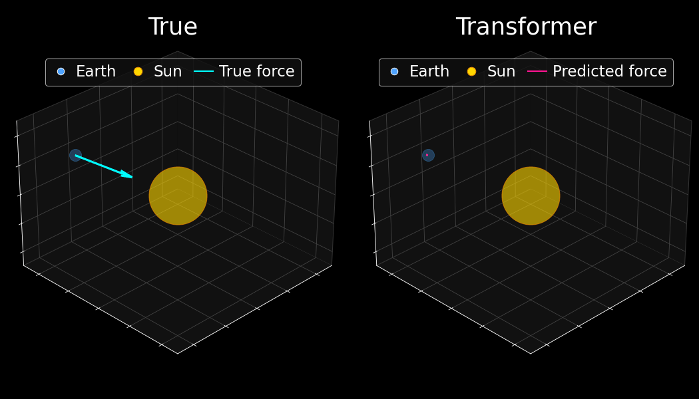
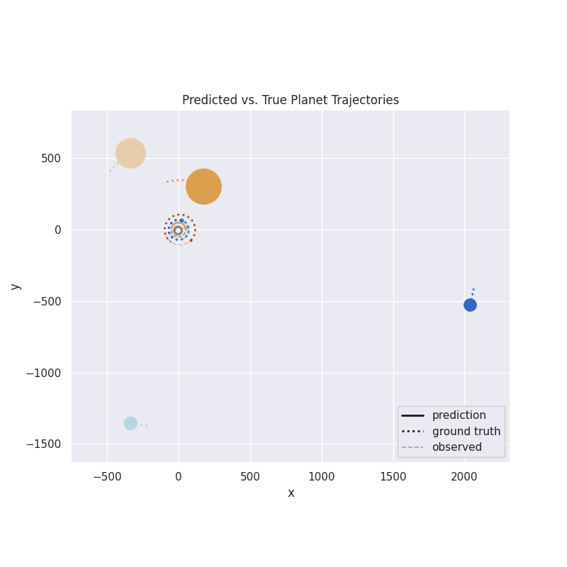

# Inductive Bias Probes

Source code for the paper ["Whas Has a Foundation Model Found? Using Inductive Bias to Probe for World Models"](https://arxiv.org/abs/2507.06952) by Keyon Vafa, Peter G Chang, Ashesh Rambachan, and Sendhil Mullainathan. 

If you find this repository useful for your research, please consider citing our work:

```
@inproceedings{vafa2025world,
  title={What Has a Foundation Model Found? Using Inductive Bias to Probe for World Models},
  author={Vafa, Keyon and Chang, Peter G and Rambachan, Ashesh and Mullainathan, Sendhil},
  booktitle={International Conference on Machine Learning},
  year={2025},
}
```


# Setup

After downloading the repo, go inside the `inductive-bias-probes` folder. 

First, make sure you have `pipx` installed.
```
sudo apt install pipx
pipx install uv
pipx ensurepath
source ~/.bashrc
```

Then, create a virtual environment and install the dependencies with `uv`.

```
uv venv ~/.venv --python 3.10.0
source ~/.venv/bin/activate
uv pip install -e '.[dev]' --no-build-isolation
uv pip install -e '.[ssm]' --no-build-isolation
```
Run `source ~/.venv/bin/activate` to activate the virtual environment.  

You may also want to log into `wandb` via `wandb login`.

## Data generation

The dataset used for pretraining in the physics experiments is large. Make sure the data directory is set up so that it can store a lot of data -- go to the `inductivebiasprobes/paths.py` file and make sure the `DATA_DIR` variable is set accordingly. 

To generate data for pretraining, go to `inductivebiasprobes/experiments/physics`. Run the following command:

```
python generate_data.py
```
For quick prototyping, pass in `--num_train_trajectories 1000`. 

## Pretraining

The training code is based on Andrej Karpathy's [nanoGPT](https://github.com/karpathy/nanoGPT) library. To train the model, run the following in `inductivebiasprobes/experiments/physics`. Note the following code assumes 8 GPUs. 

```
NUM_GPUS=8
torchrun --nproc_per_node=$NUM_GPUS train_model.py --config ntp_config --gradient_accumulation_steps $NUM_GPUS  --max_iters 600_000 --plot_trajectory  --batch_size 64 --eval_interval 250 --eval_iters 1    
```

To plot an animation of the model's predictions, run the following:

```
python plot_solar_system_orbits.py
```
That will create a gif in the `figs` directory, which will look like this:


## Adapting to new tasks
Run the following command to fine-tune the model on the small sample of force vectors in our solar system created in the `generate_data.py` script. The command below uses 1 GPU (make sure you're in the `inductivebiasprobes/experiments/physics` directory).

```
python train_model.py --config force_vector_config --pretrained next_token --learning_rate 2e-4 --max_iters 10_000 --batch_size 64 --eval_interval 10 
```

When that's done, run the following command to plot the model's force predictions:
```
python plot_forces.py
```
This will create both static images and a gif of the model's force predictions like the following. 


To see what the oracle predictions look like, run the following command:
```
python fit_force_vector_oracle.py
```
This will save a folder called `scratch/oracle`.  To plot those, replace the predictions in `plot_forces.py` with the oracle predictions. 

For the symbolic regressions, we fine-tune on data from multiple solar systems. Run the following command:

```
python train_model.py --config force_magnitude_config --pretrained next_token --max_iters 10_000 --batch_size 64 --eval_interval 50 
```

To get the symbolic regression equations, run 
```
python fit_symbolic_regression.py
```
Note that the equations might be slightly different from the ones in the paper due to random seeds. 

To get the LLM force predictions, make sure you have the following environment variables set:

```
export OPENAI_API_KEY=...
export ANTHROPIC_API_KEY=...
export GOOGLE_API_KEY=...
```

Then, run the following command. Make sure to set the `model` variable in `get_llm_forces.py` to the model you want to use (e.g. `"o3"`, `"claude-sonnet-4-20250514"`, `"gemini-2.5-pro"`).
```
python get_llm_forces.py
```
To plot the LLM force predictions, run the following command.
```
python plot_llm_forces.py
```

The code for the inductive bias probes for physics and the lattice and Othello experiments will be added soon. We're also working on sharing model checkpoints and the larger datasets. 

